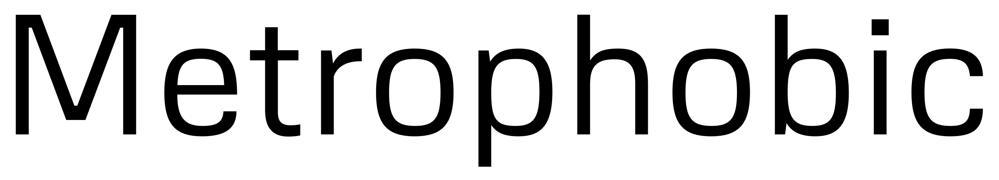
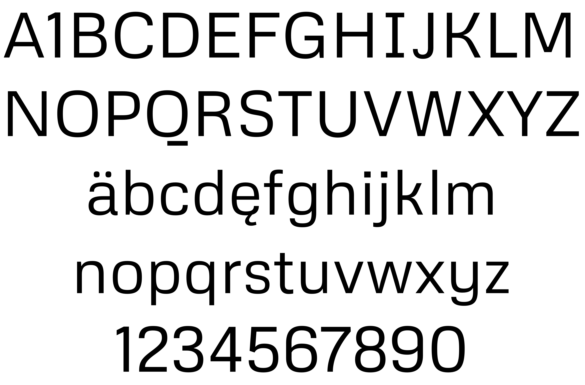

# Metrophobic
by Vernon Adams

Metrophobic is a sans serif face with a semi geometric feel. It is designed to be legible at small text sizes but also have enough character to be used as an interesting display face for headers and headlines. It can also be used for text bodies. A bolder 'display-only' version is in the pipeline.

